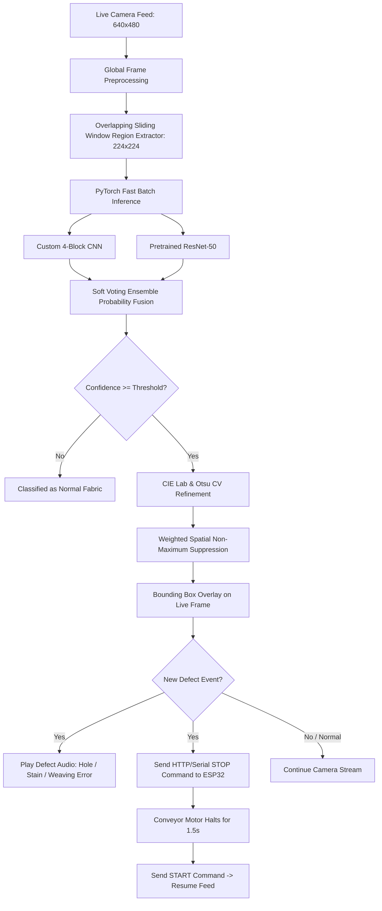
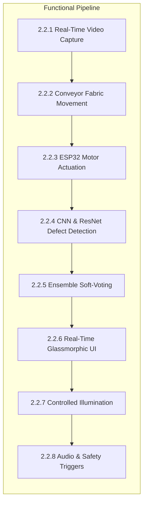
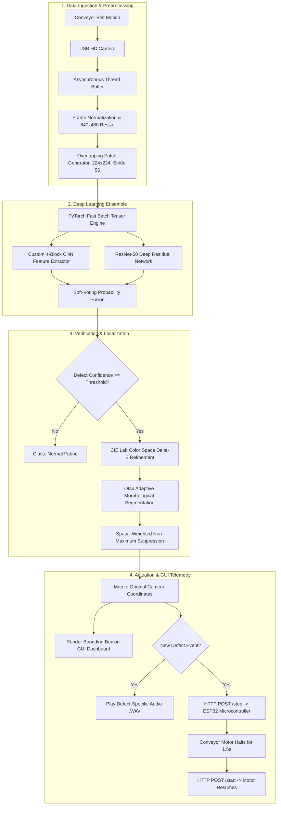
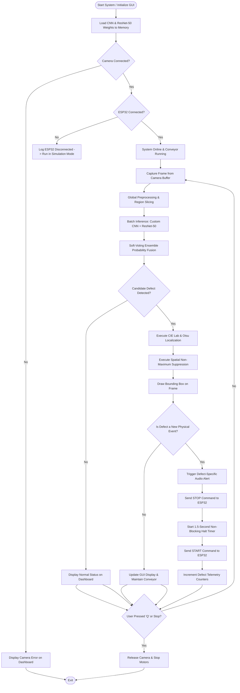
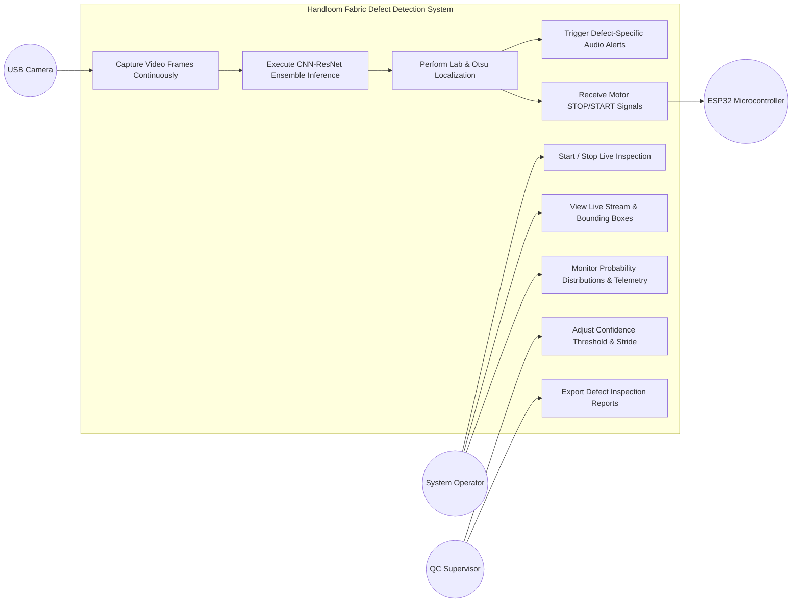
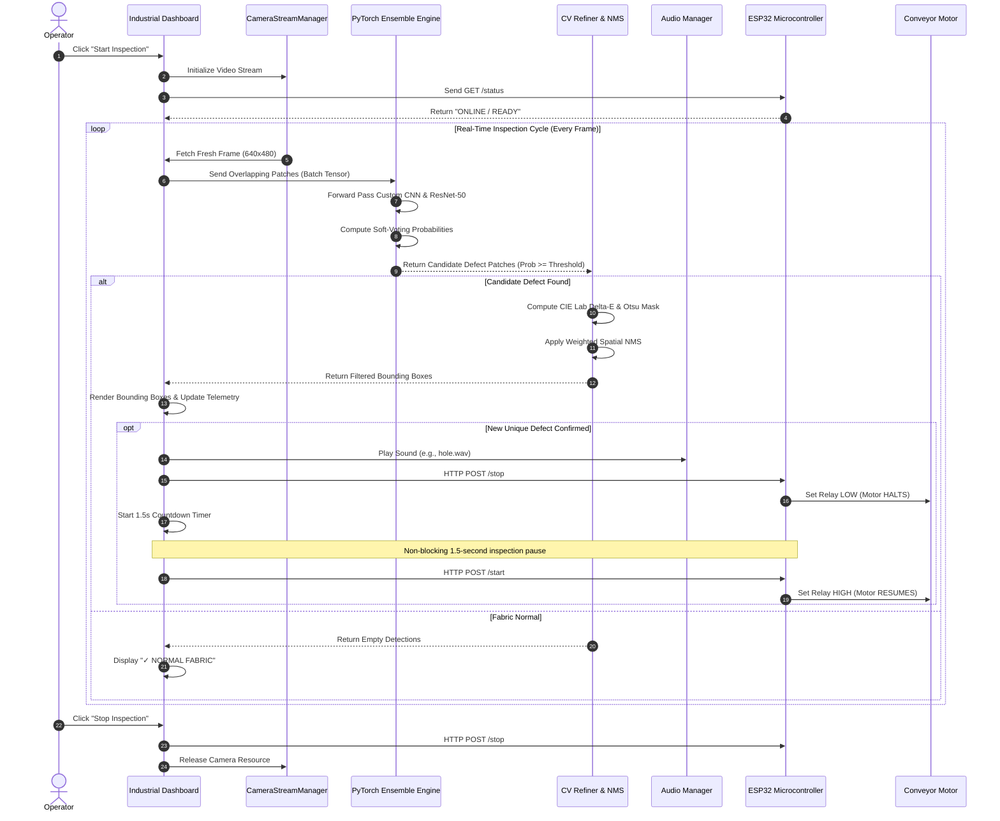
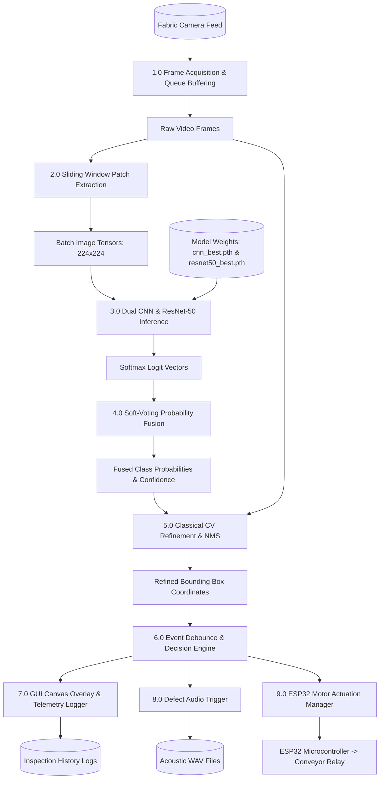
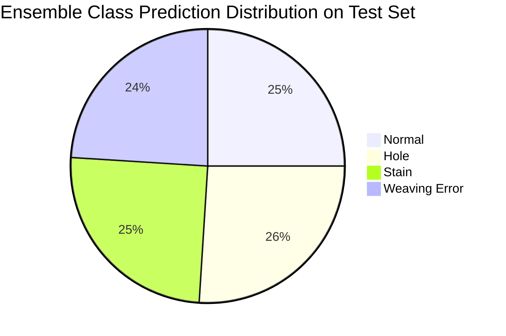

# VISVESVARAYA TECHNOLOGICAL UNIVERSITY
### JNANA SANGAMA, BELAGAVI – 590018, KARNATAKA, INDIA

---

### A PROJECT REPORT
#### on
# “AI BASED FABRIC DEFECT DETECTION FOR HANDLOOM”

---

*Submitted in partial fulfilment of the requirements for the award of*
### BACHELOR OF ENGINEERING
#### in
### COMPUTER SCIENCE & ENGINEERING

---

### Submitted By

| Name | USN |
| :--- | :--- |
| **ASHISH KRISHNA RAI D** | **4VP23CS015** |
| **B S SUJAY KRISHNA** | **4VP23CS018** |
| **DARSHAN** | **4VP23CS025** |
| **DHANUSH K P** | **4VP23CS030** |

 

### Under the Guidance of
**Prof. MANASA P**  
*Assistant Professor*  
*Department of Computer Science & Engineering*

---

 

### DEPARTMENT OF COMPUTER SCIENCE & ENGINEERING
## VIVEKANANDA COLLEGE OF ENGINEERING & TECHNOLOGY
**[A Unit of Vivekananda Vidyavardhaka Sangha Puttur (R)]**  
*Affiliated to Visvesvaraya Technological University and Approved by AICTE New Delhi & Govt. of Karnataka*  
Nehru Nagar, Puttur - 574 203, DK, Karnataka, India.  
**Academic Year: 2025 - 2026 (April 2026)**

---

## VIVEKANANDA COLLEGE OF ENGINEERING & TECHNOLOGY
### [A Unit of Vivekananda Vidyavardhaka Sangha Puttur (R)]
*Affiliated to Visvesvaraya Technological University and Approved by AICTE New Delhi & Govt. of Karnataka*  
Nehru Nagar, Puttur - 574 203, DK, Karnataka, India

### DEPARTMENT OF COMPUTER SCIENCE & ENGINEERING

 

# CERTIFICATE

Certified that the project work entitled **“AI Based Fabric Defect Detection For Handloom”** is carried out by bonafide students **Mr. Ashish Krishna Rai D, Mr. B S Sujay Krishna, Mr. Darshan, Mr. Dhanush K P** bearing USNs **4VP23CS015, 4VP23CS018, 4VP23CS025 and 4VP23CS030**, respectively, of **Vivekananda College of Engineering & Technology, Puttur** in partial fulfilment for the award of **Bachelor of Engineering** in **Computer Science & Engineering** of the **Visvesvaraya Technological University, Belagavi** during the academic year 2025–2026. It is certified that all corrections/suggestions indicated during Internal Assessment have been incorporated in the report deposited in the departmental library.

The project report has been approved as it satisfies the academic requirements in respect of Project work prescribed for the said Degree.

   

| ____________________ | ____________________ | ____________________ |
| :---: | :---: | :---: |
| **Signature of the Guide** | **Signature of the Project Coordinator** | **Signature of the HOD** |
| **Prof. Manasa P** | **Prof. Radhika Shetty D S** | **Prof. Pradeep Kumar K G** |
| Assistant Professor | Associate Professor | Professor & Head |
| Dept. of CSE, VCET | Dept. of CSE, VCET | Dept. of CSE, VCET |

  

---

### EXTERNAL VIVA

| Name of the Examiners | Signature with Date |
| :--- | :--- |
| **1.** .................................................................................... | .................................................................................... |
| **2.** .................................................................................... | .................................................................................... |

---

# DECLARATION

We, **Mr. Ashish Krishna Rai D (4VP23CS015), Mr. B S Sujay Krishna (4VP23CS018), Mr. Darshan (4VP23CS025), and Mr. Dhanush K P (4VP23CS030)**, students of B.E. 6th Semester in Computer Science & Engineering, **Vivekananda College of Engineering & Technology, Puttur**, hereby declare that the project work entitled **“AI Based Fabric Defect Detection For Handloom”** has been carried out by us at VCET, Puttur, under the guidance of **Prof. Manasa P**, Assistant Professor, Department of Computer Science & Engineering, Vivekananda College of Engineering & Technology, Puttur, and submitted in partial fulfilment of the requirements for the award of degree in **Bachelor of Engineering in Computer Science & Engineering** by **Visvesvaraya Technological University, Belagavi** during the academic year 2025–2026.

We further declare that this report has not been submitted previously by anyone for the award of any other degree or diploma to any other University or Institution.

 

| Name of the Students | USN | Signature with Date |
| :--- | :--- | :--- |
| **Ashish Krishna Rai D** | **4VP23CS015** | ____________________ |
| **B S Sujay Krishna** | **4VP23CS018** | ____________________ |
| **Darshan** | **4VP23CS025** | ____________________ |
| **Dhanush K P** | **4VP23CS030** | ____________________ |

  
**Date:** 30-04-2026  
**Place:** Puttur

---

# ABSTRACT

The Handloom Fabric Defect Detection System is developed to automate the identification and localization of defects in textile fabrics using deep learning techniques and IoT automation. Traditional manual inspection methods in textile industries are time-consuming, inconsistent, and prone to human error, particularly in large-scale production. To address these challenges, the system utilizes a dual-model soft-voting ensemble comprising a **Custom Convolutional Neural Network (CNN)** and transfer learning with **ResNet-50** to classify fabric images into four distinct categories: **weaving error, hole, stain, and normal fabric**. The model is trained on a dedicated dataset, ensuring standardization and reliability while enabling effective learning of intricate fabric defect patterns.

A complete training and evaluation pipeline is implemented in Python, incorporating data preprocessing, stratified anti-leakage splitting (70% training, 15% validation, 15% testing), data augmentation, and optimization techniques to boost model generalization. A probability-based soft-voting ensemble approach combines predictions from the Custom CNN (specialized in local texture and edge features) and ResNet-50 (specialized in deep semantic features), achieving an untouched test set accuracy of **77.78%**, macro precision of **80.46%**, macro recall of **78.27%**, and macro F1-score of **78.41%**. 

For real-time inspection, the system processes continuous live webcam frames using an overlapping sliding-window region inference approach, combined with color-space deviation (CIE $L^*a^*b^*$) and adaptive thresholding for precise bounding box localization without requiring expensive pixel-level bounding-box training. Spatial Non-Maximum Suppression (NMS) suppresses duplicate regional detections to guarantee one physical defect produces exactly one bounding box. Upon defect confirmation, the system triggers defect-specific audio alerts and transmits automated control signals via an **ESP32 microcontroller** to halt the conveyor motor for exactly 1.5 seconds, before automatically restarting fabric movement. An industrial glassmorphic dashboard provides live telemetry, probability progress bars, and inspection history. By automating defect detection and conveyor regulation, the project reduces manual effort, improves consistency, and enhances operational quality control in handloom textile manufacturing environments.

---

# ACKNOWLEDGEMENT

We take this opportunity to express our deep heartfelt gratitude to all those people who have helped us in the successful completion of the project.

First and foremost, we would like to express our sincere gratitude to our guide, **Prof. Manasa P**, Assistant Professor, Department of Computer Science & Engineering, for providing excellent guidance, constant encouragement, and valuable inspiration throughout the course of this project work. Without her invaluable guidance, constructive critique, and continuous support, this work would never have reached completion.

We would like to extend our special thanks to our Project Coordinator, **Prof. Radhika Shetty D S**, Associate Professor, Department of Computer Science & Engineering, for providing the necessary guidance, timely reviews, and academic support throughout the project lifecycle.

We express our sincere gratitude to the Head of the Department of Computer Science & Engineering, **Prof. Pradeep Kumar K G**, for his administrative support, valuable suggestions, and constant encouragement throughout our academic tenure.

We would like to thank our respected Principal, **Dr. Mahesh Prasanna K.**, for providing all the required laboratory facilities, computational infrastructure, and a conducive research environment within the college campus.

We express our gratitude to the management of **Vivekananda College of Engineering & Technology (VCET), Puttur**, for providing the necessary institutional infrastructure and resources to carry out the project work successfully.

Finally, we extend our heartfelt thanks to all the teaching and non-teaching staff members of the Department of Computer Science & Engineering, our parents, and our friends for their direct and indirect support, assistance, and encouragement rendered throughout this project.

  

**ASHISH KRISHNA RAI D (4VP23CS015)**  
**B S SUJAY KRISHNA (4VP23CS018)**  
**DARSHAN (4VP23CS025)**  
**DHANUSH K P (4VP23CS030)**  

---

## TABLE OF CONTENTS

| Title | Page No. |
| :--- | :---: |
| **List of Figures** | **I** |
| **List of Tables** | **II** |
| **CHAPTER 1: INTRODUCTION** | **01** |
| &nbsp;&nbsp;&nbsp;&nbsp;1.1 Introduction to the Project | 01 |
| &nbsp;&nbsp;&nbsp;&nbsp;1.2 Introduction to Machine Learning | 01 |
| &nbsp;&nbsp;&nbsp;&nbsp;1.3 Introduction to Deep Learning | 02 |
| &nbsp;&nbsp;&nbsp;&nbsp;&nbsp;&nbsp;&nbsp;&nbsp;1.3.1 Supervised Learning | 02 |
| &nbsp;&nbsp;&nbsp;&nbsp;&nbsp;&nbsp;&nbsp;&nbsp;1.3.2 Backpropagation to Train Multilayer Architectures | 03 |
| &nbsp;&nbsp;&nbsp;&nbsp;&nbsp;&nbsp;&nbsp;&nbsp;1.3.3 Image Understanding with Deep Convolutional Networks | 03 |
| &nbsp;&nbsp;&nbsp;&nbsp;1.4 Existing Method | 03 |
| &nbsp;&nbsp;&nbsp;&nbsp;1.5 Proposed Method | 04 |
| &nbsp;&nbsp;&nbsp;&nbsp;1.6 Literature Survey | 05 |
| **CHAPTER 2: REQUIREMENT SPECIFICATION AND ANALYSIS** | **14** |
| &nbsp;&nbsp;&nbsp;&nbsp;2.1 Introduction | 14 |
| &nbsp;&nbsp;&nbsp;&nbsp;2.2 Functional Requirements | 14 |
| &nbsp;&nbsp;&nbsp;&nbsp;&nbsp;&nbsp;&nbsp;&nbsp;2.2.1 Real-Time Video Capture and Processing | 14 |
| &nbsp;&nbsp;&nbsp;&nbsp;&nbsp;&nbsp;&nbsp;&nbsp;2.2.2 Fabric Movement using Conveyor System | 15 |
| &nbsp;&nbsp;&nbsp;&nbsp;&nbsp;&nbsp;&nbsp;&nbsp;2.2.3 Motor Control using ESP32 and Driver Module | 15 |
| &nbsp;&nbsp;&nbsp;&nbsp;&nbsp;&nbsp;&nbsp;&nbsp;2.2.4 Defect Detection using CNN and ResNet | 15 |
| &nbsp;&nbsp;&nbsp;&nbsp;&nbsp;&nbsp;&nbsp;&nbsp;2.2.5 Ensemble Prediction Mechanism | 15 |
| &nbsp;&nbsp;&nbsp;&nbsp;&nbsp;&nbsp;&nbsp;&nbsp;2.2.6 Real-Time Output Display | 15 |
| &nbsp;&nbsp;&nbsp;&nbsp;&nbsp;&nbsp;&nbsp;&nbsp;2.2.7 Lighting Control for Image Clarity | 15 |
| &nbsp;&nbsp;&nbsp;&nbsp;&nbsp;&nbsp;&nbsp;&nbsp;2.2.8 Alert and Safety Mechanisms | 16 |
| &nbsp;&nbsp;&nbsp;&nbsp;2.3 Non-Functional Requirements | 16 |
| &nbsp;&nbsp;&nbsp;&nbsp;&nbsp;&nbsp;&nbsp;&nbsp;2.3.1 Reliability and Availability | 16 |
| &nbsp;&nbsp;&nbsp;&nbsp;&nbsp;&nbsp;&nbsp;&nbsp;2.3.2 Accuracy and Robustness | 16 |
| &nbsp;&nbsp;&nbsp;&nbsp;&nbsp;&nbsp;&nbsp;&nbsp;2.3.3 Usability | 16 |
| &nbsp;&nbsp;&nbsp;&nbsp;&nbsp;&nbsp;&nbsp;&nbsp;2.3.4 Performance and Scalability | 17 |
| &nbsp;&nbsp;&nbsp;&nbsp;&nbsp;&nbsp;&nbsp;&nbsp;2.3.5 Maintainability and Compliance | 17 |
| &nbsp;&nbsp;&nbsp;&nbsp;&nbsp;&nbsp;&nbsp;&nbsp;2.3.6 Portability | 17 |
| &nbsp;&nbsp;&nbsp;&nbsp;2.4 Software Requirements | 17 |
| &nbsp;&nbsp;&nbsp;&nbsp;2.5 Hardware Requirements | 18 |
| &nbsp;&nbsp;&nbsp;&nbsp;&nbsp;&nbsp;&nbsp;&nbsp;2.5.1 ESP32 Microcontroller | 18 |
| &nbsp;&nbsp;&nbsp;&nbsp;&nbsp;&nbsp;&nbsp;&nbsp;2.5.2 DC Geared Motor | 18 |
| &nbsp;&nbsp;&nbsp;&nbsp;&nbsp;&nbsp;&nbsp;&nbsp;2.5.3 L298N Motor Driver Module | 19 |
| &nbsp;&nbsp;&nbsp;&nbsp;&nbsp;&nbsp;&nbsp;&nbsp;2.5.4 Webcam Module | 20 |
| &nbsp;&nbsp;&nbsp;&nbsp;&nbsp;&nbsp;&nbsp;&nbsp;2.5.5 LED Lighting System | 20 |
| &nbsp;&nbsp;&nbsp;&nbsp;&nbsp;&nbsp;&nbsp;&nbsp;2.5.6 Conveyor Belt Mechanism | 21 |
| &nbsp;&nbsp;&nbsp;&nbsp;&nbsp;&nbsp;&nbsp;&nbsp;2.5.7 Power Supply Unit | 21 |
| &nbsp;&nbsp;&nbsp;&nbsp;&nbsp;&nbsp;&nbsp;&nbsp;2.5.8 Supporting Frame Structure | 22 |
| **CHAPTER 3: SYSTEM DESIGN** | **23** |
| &nbsp;&nbsp;&nbsp;&nbsp;3.1 Introduction | 23 |
| &nbsp;&nbsp;&nbsp;&nbsp;3.2 System Architecture Design | 23 |
| &nbsp;&nbsp;&nbsp;&nbsp;3.3 Flow Chart | 26 |
| &nbsp;&nbsp;&nbsp;&nbsp;3.4 Use Case Diagram | 28 |
| &nbsp;&nbsp;&nbsp;&nbsp;3.5 Sequence Diagram | 30 |
| &nbsp;&nbsp;&nbsp;&nbsp;3.6 Data Flow Diagram | 32 |
| **CHAPTER 4: SYSTEM IMPLEMENTATION** | **34** |
| &nbsp;&nbsp;&nbsp;&nbsp;4.1 Introduction | 34 |
| &nbsp;&nbsp;&nbsp;&nbsp;4.2 Dataset Preparation | 34 |
| &nbsp;&nbsp;&nbsp;&nbsp;&nbsp;&nbsp;&nbsp;&nbsp;4.2.1 Data Collection | 35 |
| &nbsp;&nbsp;&nbsp;&nbsp;&nbsp;&nbsp;&nbsp;&nbsp;4.2.2 Labelling | 36 |
| &nbsp;&nbsp;&nbsp;&nbsp;4.3 Data Preprocessing | 37 |
| &nbsp;&nbsp;&nbsp;&nbsp;&nbsp;&nbsp;&nbsp;&nbsp;4.3.1 Data Cleaning & Augmentation | 37 |
| &nbsp;&nbsp;&nbsp;&nbsp;4.4 Modeling and Training | 38 |
| &nbsp;&nbsp;&nbsp;&nbsp;&nbsp;&nbsp;&nbsp;&nbsp;4.4.1 Custom CNN Model Architecture | 38 |
| &nbsp;&nbsp;&nbsp;&nbsp;&nbsp;&nbsp;&nbsp;&nbsp;4.4.2 ResNet-50 Transfer Learning Architecture | 39 |
| &nbsp;&nbsp;&nbsp;&nbsp;&nbsp;&nbsp;&nbsp;&nbsp;4.4.3 Soft Voting Ensemble Integration | 40 |
| &nbsp;&nbsp;&nbsp;&nbsp;&nbsp;&nbsp;&nbsp;&nbsp;4.4.4 Real-time Regional Inference & Bounding Box Localization | 41 |
| &nbsp;&nbsp;&nbsp;&nbsp;&nbsp;&nbsp;&nbsp;&nbsp;4.4.5 IoT ESP32 Actuation & Motor Timing Control | 42 |
| **CHAPTER 5: SYSTEM TESTING** | **43** |
| &nbsp;&nbsp;&nbsp;&nbsp;5.1 Introduction | 43 |
| &nbsp;&nbsp;&nbsp;&nbsp;5.2 Test Objectives | 43 |
| &nbsp;&nbsp;&nbsp;&nbsp;5.3 Features To Be Tested | 43 |
| &nbsp;&nbsp;&nbsp;&nbsp;5.4 Types of Tests | 44 |
| &nbsp;&nbsp;&nbsp;&nbsp;&nbsp;&nbsp;&nbsp;&nbsp;5.4.1 Unit Testing | 44 |
| &nbsp;&nbsp;&nbsp;&nbsp;&nbsp;&nbsp;&nbsp;&nbsp;5.4.2 Integration Testing | 44 |
| &nbsp;&nbsp;&nbsp;&nbsp;&nbsp;&nbsp;&nbsp;&nbsp;5.4.3 Functional Testing | 45 |
| &nbsp;&nbsp;&nbsp;&nbsp;&nbsp;&nbsp;&nbsp;&nbsp;5.4.4 System Testing | 45 |
| &nbsp;&nbsp;&nbsp;&nbsp;&nbsp;&nbsp;&nbsp;&nbsp;5.4.5 Acceptance Testing | 46 |
| &nbsp;&nbsp;&nbsp;&nbsp;5.5 Results and Analysis | 47 |
| **CHAPTER 6: SCREENSHOTS** | **50** |
| &nbsp;&nbsp;&nbsp;&nbsp;6.1 System Demonstration Screenshots | 50 |
| **CHAPTER 7: CONCLUSION AND SCOPE FOR FUTURE ENHANCEMENT** | **53** |
| &nbsp;&nbsp;&nbsp;&nbsp;7.1 Conclusion | 53 |
| &nbsp;&nbsp;&nbsp;&nbsp;7.2 Scope of Future Enhancement | 54 |
| **REFERENCES** | **55** |
| **PERSONAL PROFILE** | **58** |

---

## LIST OF FIGURES

| Figure No. | Title | Page No. |
| :---: | :--- | :---: |
| **2.1** | ESP32 Microcontroller Module | 18 |
| **2.2** | DC Geared Motor (12V High Torque) | 19 |
| **2.3** | L298N Dual H-Bridge Motor Driver Module | 19 |
| **2.4** | High-Definition USB Webcam Module | 20 |
| **2.5** | Uniform LED Lighting Strip System | 20 |
| **2.6** | Fabric Inspection Conveyor Belt Mechanism | 21 |
| **2.7** | 12V 2A Regulated Power Adapter | 21 |
| **3.1** | End-to-End System Architecture of HFDS | 25 |
| **3.2** | Live Operational Flowchart of the Inspection Pipeline | 27 |
| **3.3** | Use-Case Diagram for System Operators and Hardware | 29 |
| **3.4** | Sequence Diagram for Live Inference, NMS, and ESP32 Actuation | 31 |
| **3.5** | Data Flow Diagram (DFD Level 1) of the Inspection Workflow | 33 |
| **4.1** | Normal Fabric Sample (Defect-Free) | 36 |
| **4.2** | Hole Defect Sample | 36 |
| **4.3** | Stain Defect Sample | 37 |
| **4.4** | Weaving Error Defect Sample | 37 |
| **4.5** | Deep Custom CNN Layered Architecture Diagram | 39 |
| **4.6** | Soft-Voting Ensemble Probability Fusion Mechanism | 40 |
| **6.1** | Execution of `live_gui.py` within Terminal Environment | 50 |
| **6.2** | Industrial Dashboard Displaying Normal Fabric Inspection | 51 |
| **6.3** | Real-Time Hole Defect Localization with Bounding Box & Audio Alert | 51 |
| **6.4** | Real-Time Stain Defect Detection and 1.5s Conveyor Halt Status | 52 |
| **6.5** | Multi-Defect Frame Detection (Hole + Stain) with Distinct Overlays | 52 |

---

## LIST OF TABLES

| Table No. | Title | Page No. |
| :---: | :--- | :---: |
| **1.1** | Comprehensive Observations and Summary of Literature Survey [1]–[30] | 09 |
| **4.1** | Dataset Distribution Across Classes Before and After Augmentation | 35 |
| **4.2** | Detailed Layer Configuration of Custom CNN Model | 38 |
| **5.1** | System Functional and Acceptance Test Cases Execution Summary | 48 |
| **5.2** | Quantitative Evaluation Metrics of Custom CNN, ResNet-50, and Ensemble | 49 |

---

# CHAPTER 1
# INTRODUCTION

## 1.1 INTRODUCTION TO THE PROJECT
The textile and apparel manufacturing sectors represent one of the oldest and most economically vital pillars of global industry. Within this landscape, the traditional handloom sector holds an esteemed position due to its unique craftsmanship, intricate ethnic designs, and cultural heritage. However, the manual nature of handloom weaving introduces natural variances and defect occurrences caused by yarn inconsistencies, loom mechanical irregularities, tension fluctuations, and human error. Defects such as weaving errors (missed picks, floats, warp/weft breakage), oil/dye stains, and physical holes degrade the aesthetic and structural integrity of the fabric, leading to severe financial downgrades and substantial material waste if not identified early.

Traditionally, quality inspection in the handloom industry relies almost exclusively on manual visual examination carried out by human operators. This manual process is inherently labor-intensive, slow, subjective, and highly inconsistent. Human inspectors suffer from physical and cognitive fatigue after prolonged periods of continuous observation, leading to an estimated 30% to 40% of fabric defects slipping through undetected. As industrial quality standards become increasingly rigorous, automating the defect detection process has become a critical necessity.

To overcome the fundamental limitations of manual inspection, this project introduces the **AI-Based Handloom Fabric Defect Detection System (HFDS)**. HFDS integrates high-resolution computer vision, a dual-branch deep learning ensemble architecture, classical image-processing verification, and IoT-driven electromechanical conveyor automation. The core artificial intelligence engine leverages a hybrid ensemble consisting of a **Custom Convolutional Neural Network (CNN)** optimized for fine-grained local texture and edge patterns, and a deep **ResNet-50** model pretrained on ImageNet for extracting complex hierarchical semantic features. The probability distributions of both networks are merged through a continuous soft-voting fusion mechanism, providing highly robust multi-class classification into four primary categories: **normal fabric, holes, stains, and weaving errors**.

Furthermore, unlike static classification systems that process isolated image crops, HFDS operates directly on continuous live video streams captured from a conveyor-mounted camera. It implements an overlapping sliding-window regional inference algorithm paired with adaptive color-space ($L^*a^*b^*$) deviation thresholding and spatial Non-Maximum Suppression (NMS) to localize physical defects and draw distinct bounding boxes in original camera coordinates. Upon confirming a genuine defect, the system triggers defect-specific acoustic signals and dispatches automated control signals to an **ESP32 microcontroller** to halt the conveyor motor for precisely 1.5 seconds, allowing operators to inspect or mark the defect before resuming production.

## 1.2 INTRODUCTION TO MACHINE LEARNING
Machine Learning (ML) is a core subfield of Artificial Intelligence (AI) focused on the development of mathematical algorithms and statistical models that enable computational systems to learn patterns from historical empirical data and perform inferential tasks without explicit rule-based programming. Rather than following rigid, predefined decision trees, machine learning systems optimize internal parameters iteratively by minimizing a predefined cost or loss function.

In industrial automation and quality engineering, machine learning provides the foundational framework for pattern recognition, anomaly identification, and predictive control:
- **Data Acquisition and Representation:** Multidimensional digital inputs (such as camera video frames, sensor readings, and structural measurements) are transformed into structured numerical tensors or feature representations.
- **Pattern Learning and Generalization:** Machine learning models identify intricate statistical regularities, boundaries, and correlations within the feature space, allowing them to generalize accurately to unseen operational scenarios.
- **Inference and Decision Logic:** When deployed in real-time environments, the trained models evaluate live telemetry, categorize operational states, and dispatch automated actuation commands to downstream hardware components.

Within the HFDS framework, machine learning establishes an autonomous end-to-end bridge linking optical camera sensors, mathematical neural tensor transformations, spatial bounding box localization, and physical conveyor motor relays.

## 1.3 INTRODUCTION TO DEEP LEARNING
Deep Learning represents a sophisticated paradigm within machine learning inspired by the biological neural structures of the human brain. It utilizes deep artificial neural networks composed of multiple stacked processing layers to perform representation learning. Unlike traditional machine learning techniques that depend heavily on manual, handcrafted feature engineering (such as GLCM, HOG, or SIFT), deep learning architectures automatically learn hierarchical feature representations directly from raw pixel data. The initial layers capture primitive visual cues such as edges, gradients, and localized textures, while deeper layers synthesize these cues into high-level semantic structures, object parts, and complex surface patterns.

### 1.3.1 Supervised Learning
Supervised learning is the primary learning paradigm employed in the training of the HFDS defect recognition models. In supervised learning, the neural network is provided with a curated dataset containing pairs of input images ($x_i$) and ground-truth target labels ($y_i \in \{0, 1, 2, 3\}$ corresponding to `normal`, `hole`, `stain`, and `weaving_error`). During the forward propagation pass, the network processes the input tensor through its parameterized layers to generate a predicted probability distribution $\hat{y}_i$. A categorical cross-entropy loss function calculates the mathematical divergence between the true distribution and the predicted distribution:

$$\mathcal{L}_{CE} = -\sum_{c=1}^{C} y_{i,c} \log(\hat{y}_{i,c})$$

This loss value serves as an objective error metric indicating the model's prediction discrepancy, which is subsequently minimized during optimization.

### 1.3.2 Backpropagation to Train Multilayer Architectures
The optimization of deep neural network weights is executed via the **Backpropagation Algorithm** in conjunction with gradient-based optimization techniques (such as Adam or Stochastic Gradient Descent with Momentum). Backpropagation applies the mathematical chain rule of calculus to compute the partial derivative (gradient) of the loss function with respect to every weight parameter in the network, working backward from the output layer to the earliest convolutional layer:

$$rac{\partial \mathcal{L}}{\partial W^{[l]}} = rac{\partial \mathcal{L}}{\partial Z^{[l]}} \cdot \left(A^{[l-1]}
ight)^T$$

These calculated gradients indicate the directional adjustment required to reduce the prediction error. Optimization routines then update the weights using adaptive learning rates, iteratively refining the network until convergence is achieved.

### 1.3.3 Image Understanding with Deep Convolutional Networks
Convolutional Neural Networks (CNNs) have revolutionized digital image analysis through three core architectural principles: **local receptive fields**, **shared synaptic weights**, and **spatial pooling operations**. 

1. **Convolutional Layers:** 2D spatial filter kernels slide across input feature maps, performing discrete convolution operations to detect localized spatial features irrespective of their absolute position in the image (translation equivariance).
2. **Batch Normalization & Non-Linear Activations:** Batch Normalization stabilizes training dynamics by re-centering and scaling activations, while non-linear functions (such as Rectified Linear Units, ReLU) enable the network to model complex non-linear decision boundaries.
3. **Pooling and Spatial Reduction:** Max-pooling operations reduce spatial tensor dimensions, progressively expanding the receptive field while retaining dominant feature activations.

In this project, two complementary deep architectures are integrated:
- **Custom 4-Block CNN:** A specialized, lightweight convolutional network with progressive filter depths (64, 128, 256, 512) engineered to extract high-frequency thread textures, yarn alignments, and discrete weft discontinuities.
- **ResNet-50 Architecture:** A 50-layer deep residual network utilizing identity shortcut connections (residual skip connections) to mitigate the vanishing gradient problem. ResNet-50 extracts deep contextual semantics, broad color discolorations, and holistic fabric structural representations.

## 1.4 EXISTING METHOD
Traditional and existing approaches to fabric defect detection can be categorized into manual inspection and early automated visual inspection systems:

1. **Manual Inspection:** Human operators visually monitor fabric as it rolls across illuminated inspection tables. This method suffers from severe physiological drawbacks:
   - **Cognitive and Visual Fatigue:** Operator attention drops significantly after 20–30 minutes of continuous monitoring.
   - **Low Inspection Throughput:** Inspection speeds are constrained to 5–15 meters per minute.
   - **Subjective Assessment:** Detection consistency varies widely based on individual inspector experience, lighting conditions, and mental alertness.
   - **High Labor Costs:** Continuous manual inspection represents a recurring operational expense for manufacturing units.
2. **Classical Computer Vision & Machine Learning Approaches:** Early automated systems utilized statistical and handcrafted feature descriptors such as Gray-Level Co-occurrence Matrix (GLCM), Gabor filters, Discrete Wavelet Transforms (DWT), and morphological edge detection, combined with shallow classifiers like Support Vector Machines (SVM), K-Nearest Neighbors (KNN), or Decision Trees.
   - **Lack of Generalization:** Handcrafted features are highly brittle when exposed to diverse handloom yarn textures, natural slubs, complex floral or geometric patterns, and normal fabric variations.
   - **High False Positive Rates:** Normal textured variations are frequently misclassified as stains or weaving irregularities.
   - **Sensitivity to Illumination Changes:** Minor variations in ambient factory lighting cause catastrophic drops in segmentation and classification accuracy.

## 1.5 PROPOSED METHOD
The proposed **AI-Based Handloom Fabric Defect Detection System (HFDS)** presents a robust, end-to-end automated framework designed specifically to address the complex visual characteristics of handloom textiles while providing real-time hardware actuation.

The core innovations of the proposed system include:
1. **Dual-Model Probability-Based Soft-Voting Ensemble:** Instead of relying on a single neural network, HFDS integrates the fine-grained texture sensitivity of a Custom CNN with the deep semantic capability of ResNet-50. Their continuous softmax probability vectors are combined via soft voting ($P_{ensemble} = 0.5 \cdot P_{CNN} + 0.5 \cdot P_{ResNet}$), significantly reducing variance and eliminating single-model blind spots.
2. **Real-Time Sliding-Window Overlapping Regional Inference:** The live camera stream ($640 	imes 480$ resolution) is dynamically decomposed into overlapping regions ($224 	imes 224$ pixels with configurable stride). This ensures defects that cross grid boundaries are fully captured without requiring expensive object-detection anchor labeling.
3. **Classical Computer Vision Refinement & Context Guard:** Regional defect predictions are validated using classical computer vision methods. Stain detections are refined via CIE $L^*a^*b^*$ color-space Euclidean deviation and adaptive Otsu thresholding against the global fabric median tone, preventing patterned normal fabric from triggering false alarms.
4. **Spatial Non-Maximum Suppression (NMS):** Overlapping bounding boxes generated by adjacent sliding windows for the same physical defect are cleanly merged using intersection-over-union (IoU $\ge 0.30$) clustering.
5. **IoT ESP32 Conveyor Automation & Debounce Management:** Defect confirmations trigger defect-specific acoustic alerts and non-blocking asynchronous control signals to an ESP32 microcontroller, halting the conveyor motor for precisely 1.5 seconds before resuming fabric feed.

## 1.6 LITERATURE SURVEY
A comprehensive literature review of thirty seminal research works in the domain of textile defect detection, computer vision, deep learning ensembles, and industrial automation was conducted:

A. Das and A. Deka [1] proposed the Seg-YOLO architecture for defect detection and segmentation in handloom fabrics. Their system combined a YOLOv3 detector with a fully convolutional segmentation decoder and applied Adaptive Histogram Equalization for preprocessing on a dataset collected directly from weavers in Sualkuchi, Assam. The model achieved a mean average precision of 90.4 percent, a recall of 90.78 percent, and an F1 score of 93 percent across defect classes including float, slub, stain, and selvedge irregularity.

A. Das et al. [2] presented a comprehensive survey of deep learning approaches for handloom fabric design generation and defect detection. Their study evaluated convolutional networks, generative adversarial networks, CycleGAN, DenseNet, and YOLO-based methods on the purpose-assembled Neural-Loom dataset consisting of regional and standard handloom fabric images from Assam. The analysis revealed that conditional GANs achieved the highest PSNR for design generation while PCANet demonstrated the best structural similarity and perceptual quality metrics.

S. Borthakur et al. [3] developed YMaskNet, a multi-model ensemble architecture for handloom fabric defect detection. Their system fused a YOLO detector, MobileNetV2 feature extractor, bidirectional feature pyramid network, and Mask R-CNN segmentation module into a unified pipeline trained on 240 real handloom samples collected from Sualkuchi and augmented to 4500 images across five defect classes. The proposed architecture achieved the highest precision and recall among all compared methods for detecting small and fine-grained defects in handloom fabrics.

L. B. Mahanta et al. [4] investigated deep learning-based recognition of handloomed fabrics using a large annotated image repository. Their study compiled 17,484 images of Assamese handloom Gamucha fabric and evaluated a purpose-designed convolutional network against six pretrained architectures including VGG16, VGG19, ResNet50, InceptionV3, InceptionResNetV2, and DenseNet201. The custom model outperformed all pretrained alternatives in both precision and recall, confirming the importance of domain-specific architecture design for handloom fabric classification.

A. Das et al. [5] applied deep metric learning to authenticate traditional handloom textiles and distinguish genuine handloom products from powerloom imitations. Their system trained on annotated handloom fabric images and demonstrated that learned deep features capture weave-structure characteristics that are sufficiently distinctive for reliable fabric-type classification. The study confirmed that convolutional feature representations are effective for handloom-specific visual analysis even without defect-level labelling.

S. Malathi et al. [6] conducted a systematic comparative evaluation of ten pretrained convolutional neural network architectures for fabric defect detection and quality assurance. Their study fine-tuned VGG16, ResNet50, InceptionV3, Xception, InceptionResNetV2, DenseNet121, NasNetLarge, EfficientNetB0, EfficientNetB3, and MobileNetV2 on the TILDA 400 dataset consisting of 800 images per class across five defect categories. InceptionResNetV2 demonstrated the most balanced performance with a test accuracy of 85.75 percent across both defective and non-defective fabric classes.

W. Song et al. [7] proposed an improved YOLOv8 architecture for textile defect detection incorporating structural reparameterisation and multi-scale feature aggregation adjustments. Their modified network was trained and validated on the AITEX fabric benchmark dataset and demonstrated improved detection accuracy over the standard YOLOv8 baseline for woven fabric defect classes. The study confirmed that architectural modifications to the YOLOv8 backbone improve feature discrimination for textile surface irregularities.

F. G. Yasar Ciklacandir et al. [8] examined the performance of seven different feature representations for fabric defect classification using three classical machine learning classifiers. Their study combined discrete cosine transform coefficients, principal component analysis projections, grey-level co-occurrence matrix statistics, and deep features extracted from ResNet-18 with support vector machine, k-nearest neighbour, and decision tree classifiers on a six-class fabric defect dataset. The results confirmed that convolutional deep features derived from ResNet-18 consistently achieved the highest F1 score of 0.831 across all classifier combinations.

B. Akgun et al. [9] investigated the effectiveness of deep learning models with explainable artificial intelligence evaluation for fabric defect identification in the textile industry. Their study trained ResNet18 and EfficientNetV2m models using Adam and Ranger optimization functions on a custom Turkish textile dataset containing lines, wrinkle marks, machine oil leaks, holes, and bleaching defects. ResNet18 combined with Adam optimization achieved 99.30 percent accuracy while EfficientNetV2m with Adam reached 99.42 percent, demonstrating that simple shallow networks can rival complex architectures for textile defect classification.

X. Li et al. [10] proposed a real-time convolutional neural network for fabric defect detection using a parallel efficient integration structure designated PEI-YOLOv5. Their architecture was designed to achieve high detection accuracy while maintaining inference throughput compatible with in-line manufacturing inspection requirements on a six-class woven fabric dataset. The proposed method achieved 96.5 percent classification accuracy while preserving real-time processing capability, outperforming standard single-stage detectors on the evaluated fabric defect classes.

S. S. Mohammed et al. [11] developed an advanced fully convolutional neural network capable of performing simultaneous defect detection, classification, and pixel-level localisation within textile fabric images. Their architecture processed input images of size 256 by 256 pixels and generated defect masks without requiring multi-stage pipelines, reducing computational overhead compared to region-based methods. Experimental results demonstrated that the proposed network outperformed baseline convolutional classifiers in defect localisation accuracy on the evaluated fabric defect dataset.

F. Cui et al. [12] presented a comprehensive review of deep learning methods for textile and colour defect detection covering the evolution from AlexNet to contemporary vision transformer architectures. Their analysis surveyed convolutional networks, ResNet variants, MLP-Mixer, and hybrid CNN-ViT models evaluated across the AITEX, TILDA, Tianchi, and MVTec benchmark datasets. The review concluded that hybrid CNN-transformer architectures currently achieve the best generalisation across diverse fabric types and defect categories.

A. Farooq et al. [13] designed a deep convolutional neural network with an attention module for fabric defect detection under real-world manufacturing conditions. Their system was trained and evaluated on an industrial fabric dataset comprising eight defect categories collected from a textile production facility. The attention-augmented convolutional network achieved 97.3 percent classification accuracy under real manufacturing conditions, demonstrating robustness to lighting variation and fabric position inconsistency.

S. Sasmita et al. [14] developed an enhanced deep convolutional neural network for textile fabric defect detection designed for deployment alongside human operators in collaborative inspection environments. Their architecture incorporated safety-aware processing constraints and was evaluated on a five-class textile defect dataset under conditions representative of real manufacturing settings. The proposed system achieved 96.92 percent classification accuracy with latency suitable for real-time quality control alongside human supervisors.

L. Zhou et al. [15] proposed DCFE-YOLO, a novel fabric defect detection method that introduced partial convolution operations to reduce redundant feature map representations within the standard YOLO detection pipeline. Their system was evaluated on the Tianchi fabric defect dataset and a custom fabric image collection, demonstrating competitive detection accuracy with reduced computational overhead compared to baseline YOLO architectures. The partial convolution design effectively suppressed uninformative feature channels while preserving defect-relevant spatial information.

X. Liu et al. [16] introduced DA-YOLOv8s, a modified YOLOv8 architecture incorporating polarised self-attention mechanisms to improve detection of low-contrast fabric defects against complex background textures. Their system targeted defect categories that are visually subtle and difficult to distinguish from normal fabric surface variations, addressing a known limitation of standard detection architectures. Experimental results confirmed high precision and real-time processing speed for low-contrast defect detection on the evaluated industrial fabric dataset.

M. A. Hossain et al. [17] validated a YOLOv8-based pipeline for automated fabric defect detection against operational requirements in an automated factory production setting. Their study used a custom textile dataset collected under real manufacturing conditions and evaluated the model across multiple defect categories encountered in garment production lines. The proposed system achieved 91.2 percent mean average precision at a fifty percent threshold, confirming suitability for real-time industrial deployment in automated inspection environments.

S. Talukder et al. [18] presented a real-time textile defect detection system leveraging YOLOv11 deployed on NVIDIA Jetson Orin Nano edge computing hardware. Their system was designed for deployment on solid-coloured cotton and linen fabrics and detected defects including holes, colour bleeding, and creases under controlled industrial lighting conditions. The study demonstrated that accurate defect detection is achievable on edge hardware without cloud-side inference infrastructure, enabling deployment in resource-constrained manufacturing environments.

C. Chen et al. [19] proposed an improved YOLOv8 architecture with adaptive convolution kernels whose shape parameters are optimised during training for fabric defect detection. Their modified network was evaluated on the AITEX dataset combined with a custom fabric collection comprising seven defect categories and demonstrated a 3.2 percentage point improvement in mAP50 over the standard YOLOv8 baseline. The adaptive convolution design improved sensitivity to defects of irregular shape and variable size within complex textile backgrounds.

M. R. Khan et al. [20] developed an ensemble deep learning system combining YOLOv8 object detection with five convolutional classifiers including VGG16, ResNet50, MobileNet, InceptionV3, and Xception for real-time textile fabric defect detection. Their weighted soft-voting ensemble mechanism assigned higher prediction influence to models with demonstrably higher historical accuracy and was evaluated on a six-class custom textile fabric dataset. The ensemble achieved a mean average precision of 0.89 and an overall classification accuracy of 90 percent, representing a 3.4 percentage point improvement over the best individual component model.

Q. Li et al. [21] introduced FabricMamba, a fabric surface defect detection system built around large-kernel attention operations and a visual state-space model component. Their architecture was designed to capture long-range spatial dependencies in fabric texture patterns that conventional convolutional networks with small receptive fields cannot adequately model. FabricMamba achieved 99.4 percent detection accuracy at 186 frames per second, establishing the current state-of-the-art performance benchmark for real-time fabric surface inspection.

H. Kaur et al. [22] proposed a hybrid PatchNet-Attention architecture that integrates patch-based feature extraction with a convolutional block attention module for multi-type fabric defect classification. Their system partitioned input fabric images into overlapping local regions before applying attention-guided classification, improving sensitivity to small and localised defect patterns compared to whole-image classification approaches. Experimental evaluation on a multi-fabric defect dataset confirmed improved F1 scores over individual convolutional neural network and transformer baselines across all evaluated defect categories.

H. Liu et al. [23] designed an unsupervised fabric defect detection framework based on knowledge distillation that transfers defect detection capability from a large pretrained teacher network to a compact student model. Their approach was evaluated on the AITEX and Tianchi fabric datasets without requiring labelled defect images for training, demonstrating that anomaly detection is achievable through distribution discrepancy analysis between teacher and student feature representations. The framework achieved competitive detection accuracy compared to supervised methods while eliminating the annotation cost associated with labelled defect data collection.

Z. Jia et al. [24] proposed a fabric defect detection system based on transfer learning and an improved Faster R-CNN architecture. Their method replaced the VGG16 feature extraction backbone with ResNet50 combined with a feature pyramid neck and ROI alignment pooling, addressing the limitations of region mismatch caused by standard ROI pooling quantisation. Experimental results on a yarn fabric dataset comprising five defect classes demonstrated substantially improved small defect localisation accuracy compared to the VGG16-based baseline.

F. G. Ciklacandir et al. [25] developed a fabric surface defect classification system using a pretrained ResNet50 model fine-tuned through cuckoo search metaheuristic optimisation. Their approach applied cuckoo search to identify optimal hyperparameter configurations using classification error as the fitness function, systematically improving generalisation performance on a multiclass fabric defect benchmark beyond what standard gradient-based fine-tuning achieved. Experimental results confirmed 95.36 percent accuracy and a 95.35 percent F1 score for multiclass defect classification on the evaluated fabric surface dataset.

A. Beljadid et al. [26] investigated fabric defect classification using transfer learning with three pretrained deep learning architectures. Their study fine-tuned GoogleNet, VGG16, and ResNet under matched training conditions on the TILDA fabric dataset comprising four defect class categories and compared their performance against baseline training from random initialisation. ResNet consistently achieved higher classification accuracy with fewer trainable parameters compared to VGG16, confirming the advantage of residual learning for textile defect feature extraction under limited data conditions.

S. R. Arshad et al. [27] examined the performance of ResNet and VGG16 deep learning models for automated fabric defect detection on both patterned and plain fabric images. Their study evaluated both architectures on a custom dataset combining patterned and plain fabric samples with multiple defect types and compared classification accuracy across fabric categories. ResNet achieved 73.91 percent overall accuracy and consistently outperformed VGG16 on both fabric types, confirming that residual connections provide more discriminative feature representations for complex textile surface analysis.

A. Zahra et al. [28] proposed an efficient deep learning system for fabric defect detection with explainable artificial intelligence evaluation. Their system was trained on a custom fabric defect dataset comprising stain, hole, and tear defect classes and incorporated gradient-based visualisation to highlight image regions contributing most strongly to each classification decision. Results demonstrated that the proposed model accurately identified defect regions and that explainability analysis improved inspector confidence in automated classification outputs for quality control applications.

A. Rasheed et al. [29] presented a comprehensive review of computer vision and deep learning methods applied to fabric defect detection across multiple benchmark datasets. Their analysis covered histogram-based, colour-based, texture-based segmentation methods and the latest convolutional network architectures evaluated on the AITEX, TILDA, Tianchi, and MVTec datasets. The review identified class imbalance, limited defect sample availability, and the absence of visual interpretability mechanisms as the three most frequently reported challenges in automated fabric inspection systems.

C. Shorten et al. [30] published a comprehensive survey of image data augmentation strategies for deep learning covering geometric transformations, colour space perturbations, kernel filter operations, random erasing, and generative adversarial network-based synthetic data generation. Their analysis evaluated augmentation effectiveness across multiple computer vision benchmarks including textile and surface inspection datasets and confirmed that combining multiple transformation types consistently reduces model overfitting when domain-specific labelled training data is limited. The survey recommended GAN-based augmentation as the most effective strategy for generating realistic synthetic training samples in data-scarce application domains.

### Table 1.1: Observations and Summary of Literature Survey

| Author Name | Description / Technique Used | Advantages | Disadvantages |
| :--- | :--- | :--- | :--- |
| **A. Das et al. [1]** | Seg-YOLO combining YOLOv3 and segmentation decoder | High detection accuracy (mAP 90.4%) with precise localization on complex weaver patterns. | High computational resource demand due to dual-head architecture. |
| **A. Das et al. [2]** | Survey of CNN, GAN, DenseNet, and YOLO models | Comprehensive overview of generative design and detection architectures. | Pure survey; does not provide an integrated hardware-software implementation. |
| **S. Borthakur et al. [3]** | YMaskNet (YOLO + MobileNet + Mask R-CNN) | Fuses multi-scale feature pyramids for high-precision micro-defect segmentation. | Highly complex and computationally expensive; challenging for real-time edge deployment. |
| **L. Mahanta et al. [4]** | Custom CNN vs. Pretrained CNNs on Gamucha fabric | Domain-specific custom CNN outperforms general pretrained networks on local weaves. | Requires substantial manually annotated datasets; long training duration. |
| **A. Das et al. [5]** | Deep metric learning for fabric authenticity | Learns distinct weave-structure embeddings without requiring pixel defect annotations. | Primarily designed for fabric classification rather than localized defect bounding. |
| **S. Malathi et al. [6]** | Comparative analysis of 10 Pretrained CNNs | Evaluates model selection trade-offs; InceptionResNetV2 achieved 85.75% accuracy. | Training multiple heavy models significantly increases training and inference overhead. |
| **W. Song et al. [7]** | Modified YOLOv8 with reparameterisation | Multi-scale aggregation improves sensitivity to small textile surface irregularities. | Architectural complexity requires extensive hyperparameter tuning. |
| **F. Ciklacandir et al. [8]** | Hybrid handcrafted features + ML classifiers | Interpretable feature representation with lower training complexity. | Inferior accuracy and weak generalization on complex handloom motifs. |
| **B. Akgun et al. [9]** | ResNet-18 & EfficientNetV2 with Explainable AI | Achieves >99% accuracy on Turkish textiles with visual gradient interpretability. | Performance depends heavily on clean data; vulnerable to industrial lighting shifts. |
| **X. Li et al. [10]** | PEI-YOLOv5 for in-line fabric inspection | High-speed inference throughput suitable for factory conveyor speeds (96.5% acc). | Misses subtle low-contrast fabric defects and yarn misalignments. |
| **S. Mohammed et al. [11]** | Fully Convolutional Network (FCN) for masking | Pixel-level defect localization without requiring multi-stage region proposal nets. | High GPU memory consumption; slower frame rates on standard CPU hardware. |
| **F. Cui et al. [12]** | Review of CNN and Vision Transformer methods | Exhaustive study on hybrid CNN-ViT models across benchmark datasets. | Theoretical review lacking live embedded hardware integration. |
| **A. Farooq et al. [13]** | Attention-augmented CNN for manufacturing | Robust against industrial lighting fluctuations and fabric position shifts (97.3% acc). | Training attention maps increases computational latency. |
| **S. Sasmita et al. [14]** | Enhanced DCNN for collaborative inspection | Low-latency inference designed for deployment alongside human supervisors. | Moderate accuracy on subtle weaving errors; requires further tuning. |
| **L. Zhou et al. [15]** | DCFE-YOLO with partial convolutions | Suppresses uninformative feature channels; reduces FLOPs and memory footprint. | Slight reduction in classification accuracy compared to heavy backbones. |
| **X. Liu et al. [16]** | DA-YOLOv8s with polarized self-attention | Superior detection of low-contrast stains and holes against textured backgrounds. | Complex training setup; requires specialized GPU acceleration. |
| **M. Hossain et al. [17]** | Industrial YOLOv8 automated pipeline | Validated on actual garment production lines with 91.2% mAP50. | High hardware dependency on dedicated discrete industrial GPUs. |
| **S. Talukder et al. [18]** | YOLOv11 deployed on NVIDIA Jetson Orin | Edge computing pipeline eliminates cloud latency for solid fabrics. | Constrained edge compute reduces FPS when scaling to multi-camera setups. |
| **C. Chen et al. [19]** | Adaptive convolution YOLOv8 architecture | Deformable kernels adapt effectively to irregular hole and tear contours. | High training complexity; sensitive to kernel shape initialization. |
| **M. Khan et al. [20]** | Ensemble of YOLOv8 and 5 CNN Classifiers | Soft-voting mechanism improves overall accuracy by 3.4% over single models. | High combined computational cost and slower frame ingestion latency. |
| **Q. Li et al. [21]** | FabricMamba State-Space Model | Captures ultra long-range spatial dependencies at 186 FPS (99.4% accuracy). | Extremely complex architecture; non-trivial deployment on standard edge devices. |
| **H. Kaur et al. [22]** | Hybrid PatchNet with CBAM Attention | Local patch partitioning boosts sensitivity to minute localized defect patterns. | High compute overhead when sliding thousands of patch windows per frame. |
| **H. Liu et al. [23]** | Unsupervised Knowledge Distillation framework | Eliminates manual defect annotation cost using anomaly distribution discrepancy. | Lower precision on complex multi-class defect categorizations. |
| **Z. Jia et al. [24]** | Faster R-CNN with ResNet50 & RoIAlign | Resolves region mismatch quantization for small yarn defects. | Significantly slower inference compared to single-stage detectors. |
| **F. Ciklacandir et al. [25]** | Cuckoo Search optimized ResNet50 | Metaheuristic hyperparameter optimization reaches 95.36% classification accuracy. | Metaheuristic search is computationally intensive during the training phase. |
| **A. Beljadid et al. [26]** | Transfer learning evaluation (GoogleNet vs. ResNet) | Confirms residual learning superiority under small-sample regime constraints. | Pretrained ImageNet weights still require domain-specific fine-tuning. |
| **S. Arshad et al. [27]** | ResNet vs. VGG16 on patterned textiles | Demonstrates residual connections provide superior feature discrimination. | Overall accuracy on complex patterns remains moderate without ensemble fusion. |
| **A. Zahra et al. [28]** | Explainable AI (Grad-CAM) for textile defects | Increases operator trust by visually highlighting decision-making image regions. | Grad-CAM overlays add minor post-processing rendering latency. |
| **A. Rasheed et al. [29]** | Review of CV & Deep Learning in Textiles | Systematically categorizes class imbalance, lack of data, and interpretability gaps. | Review paper without experimental code or hardware benchmarks. |
| **C. Shorten et al. [30]** | Survey on Data Augmentation Strategies | Establishes best practices for geometric, photometric, and synthetic expansions. | Improper augmentations can introduce artificial artifacts unrepresentative of real fabrics. |

---

# CHAPTER 2
# REQUIREMENT SPECIFICATION AND ANALYSIS

## 2.1 INTRODUCTION
Software and hardware requirements analysis forms the engineering foundation for developing the real-time AI-Based Handloom Fabric Defect Detection System. The requirement analysis phase translates operational manufacturing challenges into measurable, actionable, testable, and traceable engineering specifications. The objective is to design a high-throughput, low-latency, and highly reliable inspection system that seamlessly synchronizes optical video capture, neural inference, classical computer vision verification, acoustic alarming, and IoT electromechanical motor control.

## 2.2 FUNCTIONAL REQUIREMENTS
Functional requirements define the specific operational behaviors, processing stages, input transformations, and hardware outputs executed by the HFDS system.

### 2.2.1 Real-Time Video Capture and Processing
The system must continuously acquire video frames from an overhead mounted USB camera at a minimum resolution of $640 	imes 480$ pixels at $\ge 25$ frames per second. An asynchronous `CameraStreamManager` daemon thread must buffer frames into a thread-safe memory queue to prevent I/O blocking during inference.

### 2.2.2 Fabric Movement using Conveyor System
Fabric must be continuously conveyed beneath the camera field of view via an automated belt mechanism driven by a 12V high-torque DC geared motor. The motion must remain smooth and linear to prevent optical motion blur and fabric buckling.

### 2.2.3 Motor Control using ESP32 and Driver Module
An onboard **ESP32 microcontroller** interfaced with an **L298N Dual H-Bridge motor driver** must regulate the conveyor motor. The system must support bidirectional commands over HTTP REST endpoints (`/stop`, `/start`, `/status`) or serial UART communications.

### 2.2.4 Defect Detection using CNN and ResNet
The system must categorize fabric patches into four mutually exclusive classes: `normal`, `hole`, `stain`, and `weaving_error`. The Custom CNN extracts fine thread structures, while ResNet-50 captures broad geometric and tonal anomalies.

### 2.2.5 Ensemble Prediction Mechanism
Predictions from both models must be merged using an unweighted or confidence-weighted soft-voting probability fusion formula:

$$P_{ensemble}(c) = rac{P_{CNN}(c) + P_{ResNet}(c)}{2}, \quad orall c \in \{0, 1, 2, 3\}$$

The ensemble output must pass a configurable confidence threshold ($	heta_{conf} pprox 0.60 - 0.75$) before being flagged as a candidate defect.

### 2.2.6 Real-Time Output Display
The system must render a real-time industrial graphical dashboard displaying the live camera stream, bounding boxes, defect labels, confidence percentages, model probability progress bars, telemetry counters, and historical defect logs.

### 2.2.7 Lighting Control for Image Clarity
An integrated auxiliary LED lighting system must provide uniform diffuse illumination (5500K–6500K color temperature) across the inspection area, eliminating shadows, glare, and ambient light flicker.

### 2.2.8 Alert and Safety Mechanisms
Upon confirming a genuine, non-duplicate defect:
1. Play a defect-specific acoustic alert (`hole.wav`, `stain.wav`, `weaving_error.wav`).
2. Dispatch an immediate `/stop` command to the ESP32 to halt the conveyor.
3. Maintain the conveyor halt for exactly **1.5 seconds** using non-blocking asynchronous timers.
4. Dispatch a `/start` command to resume inspection automatically.

## 2.3 NON-FUNCTIONAL REQUIREMENTS

### 2.3.1 Reliability and Availability
The system must operate continuously in industrial production environments without memory leaks or software crashes. Fault-tolerant exception handling must intercept camera disconnections, ESP32 socket timeouts, and invalid image tensors without halting the application.

### 2.3.2 Accuracy and Robustness
The system must maintain high classification accuracy across diverse weave patterns and yarn colors. It must incorporate global context conflict guards to prevent textured normal fabrics from being erroneously classified as stains.

### 2.3.3 Usability
The user interface must be clean, responsive, and intuitive. Operators with minimal technical training must be able to start/stop inspection, adjust confidence thresholds, and review defect logs effortlessly.

### 2.3.4 Performance and Scalability
End-to-end inference latency per frame (including sliding-window extraction, batch inference, NMS, and UI rendering) must remain under 120 ms on standard multi-core CPU hardware, and under 30 ms when GPU acceleration is enabled.

### 2.3.5 Maintainability and Compliance
The software architecture must follow strict modular design principles, isolating data ingestion, model inference, localization algorithms, hardware drivers, and GUI presentation into decoupled modules.

### 2.3.6 Portability
The software stack must be cross-platform compatible across Windows 10/11, Ubuntu Linux, and macOS environments, requiring standard Python 3.10+ runtimes.

## 2.4 SOFTWARE REQUIREMENTS
- **Operating System:** Windows 10 / 11 (64-bit) or Ubuntu Linux 22.04 LTS
- **Programming Language:** Python 3.10+
- **Deep Learning Framework:** PyTorch 2.x, Torchvision
- **Computer Vision Libraries:** OpenCV (cv2), NumPy, Scikit-learn, Matplotlib
- **Web & Asynchronous Framework:** FastAPI, Uvicorn, Requests
- **Development Tools:** Visual Studio Code, PyCharm, Git Version Control

## 2.5 HARDWARE REQUIREMENTS

### 2.5.1 ESP32 Microcontroller
A 32-bit dual-core Xtensa LX6 microprocessor operating up to 240 MHz with integrated Wi-Fi (802.11 b/g/n) and Bluetooth 4.2. In this project, the ESP32 acts as the dedicated real-time hardware controller, hosting a lightweight HTTP REST server and generating PWM signals to control motor operation and speed.

### 2.5.2 DC Geared Motor
A 12V DC permanent magnet geared motor capable of delivering high starting torque at low rotational speeds (30–60 RPM). The integrated metal gearbox ensures constant conveyor speed under varying fabric roll loads.

### 2.5.3 L298N Motor Driver Module
A high-voltage, high-current dual full-bridge driver designed to accept standard TTL logic levels and drive inductive loads. It bridges the low-voltage ESP32 GPIO pins (3.3V) with the 12V DC motor, providing optical isolation, direction control, and PWM speed regulation.

### 2.5.4 Webcam Module
A high-definition USB 2.0/3.0 optical camera with manual/auto-focus capability, capable of streaming uncompressed YUY2/MJPEG video at $1920 	imes 1080$ px and $640 	imes 480$ px at 30 FPS.

### 2.5.5 LED Lighting System
A high-CRI (Color Rendering Index $\ge 90$) 12V daylight white LED strip array mounted in a circular/linear diffuser configuration above the conveyor bed to provide shadow-free, uniform surface illumination.

### 2.5.6 Conveyor Belt Mechanism
A precision mini-conveyor chassis constructed with anti-static PVC belt material, aluminum extrusion rails, low-friction guide rollers, and an adjustable belt tensioning mechanism.

### 2.5.7 Power Supply Unit
A regulated 12V 2A DC switch-mode power adapter (SMPS) providing stable, ripple-free electrical power to the DC motor, L298N driver, LED lighting array, and step-down voltage regulators.

### 2.5.8 Supporting Frame Structure
An adjustable rigid aluminum/acrylic frame stand designed to mount the camera and lighting fixtures at a calibrated vertical distance (15–25 cm) directly perpendicular to the conveyor inspection plane.

---

# CHAPTER 3
# SYSTEM DESIGN

## 3.1 INTRODUCTION
System design is the process of translating product requirements and conceptual architectures into detailed structural representations, modular components, communication protocols, and execution workflows. The system design of HFDS is engineered to guarantee low-latency real-time inference, high modularity, thread-safe asynchronous operations, and fail-safe electromechanical interactions.

## 3.2 SYSTEM ARCHITECTURE DESIGN
The HFDS architecture is structured into six decoupled layers operating in harmonious synchronization:

1. **Physical Sensing & Conveyor Layer:** The mechanical conveyor belt advances the fabric beneath a calibrated optical camera and diffuse LED lighting array.
2. **Asynchronous Frame Ingestion Layer:** A dedicated background thread captures video frames into a thread-safe double-buffer queue, decoupling camera hardware I/O from AI inference compute.
3. **Regional Sliding-Window Partitioning Layer:** Incoming frames are scaled to an analytical working resolution ($640 	imes 480$). An overlapping sliding window generates $224 	imes 224$ px patches with configurable stride ($S=56$ px, overlap $=75\%$).
4. **Dual Deep Learning Ensemble Layer:** The extracted patches are batched into a 4D tensor ($B 	imes 3 	imes 224 	imes 224$) and passed simultaneously through the **Custom CNN** and **ResNet-50** networks. Logits are converted to probability distributions via Softmax and merged through soft-voting fusion:

$$P_{ensemble}(c) = rac{1}{2} \left[ rac{e^{z_{CNN,c}}}{\sum_{j} e^{z_{CNN,j}}} + rac{e^{z_{ResNet,c}}}{\sum_{j} e^{z_{ResNet,j}}} 
ight]$$

5. **Classical CV Localization & Non-Maximum Suppression (NMS):** 
   - Candidate defective patches ($\max_c P(c) \ge 	heta_{conf}$, $c 
eq 	ext{normal}$) undergo localized verification.
   - For stains: The patch is converted to CIE $L^*a^*b^*$ color space. Euclidean color distance $\Delta E = \sqrt{(L - L_0)^2 + (a - a_0)^2 + (b - b_0)^2}$ is computed against the median fabric background tone, followed by Otsu thresholding.
   - Overlapping bounding boxes representing the same physical defect are clustered using spatial Non-Maximum Suppression with an Intersection-over-Union (IoU) threshold of 0.30:

$$	ext{IoU}(B_1, B_2) = rac{	ext{Area}(B_1 \cap B_2)}{	ext{Area}(B_1 \cup B_2)}$$

6. **Actuation, Alert & Telemetry Layer:** Unique verified defects trigger acoustic alerts and send HTTP POST requests to the ESP32. An asynchronous timer halts the conveyor for 1.5 seconds, while the glassmorphic dashboard renders real-time visual feedback.

## 3.3 FLOW CHART
The operational logic flow chart defines the sequential execution cycle from system initialization to live continuous monitoring and shutdown:

## 3.4 USE CASE DIAGRAM
The use case diagram illustrates the interactions between primary system actors (System Operator, Quality Control Supervisor) and hardware agents (ESP32 Controller, USB Camera).

## 3.5 SEQUENCE DIAGRAM
The sequence diagram details the precise message exchange and chronological execution order between system threads, neural engines, computer vision filters, and external IoT controllers:

## 3.6 DATA FLOW DIAGRAM
The Data Flow Diagram (Level 1 DFD) maps the transformation and flow of data from optical pixel streams to physical motor actuation:

---

# CHAPTER 4
# SYSTEM IMPLEMENTATION

## 4.1 INTRODUCTION
The system implementation phase translates architectural blueprints and algorithmic designs into functional, high-performance software modules and physical hardware integrations. HFDS is developed in Python 3.10 utilizing PyTorch, OpenCV, Torchvision, NumPy, and FastAPI, communicating with an ESP32 microcontroller programmed in embedded C++ via the Arduino core.

## 4.2 DATASET PREPARATION
High-quality, balanced, and verified training data is fundamental to the generalization of deep convolutional architectures. For this project, a dedicated handloom fabric defect dataset comprising four primary classes was established.

### 4.2.1 Data Collection
High-resolution photographs of authentic handloom fabrics were captured under controlled industrial illumination. The dataset contains approximately 400 original high-resolution samples distributed across four categories:
1. **Normal Fabric:** Clean, defect-free handloom weave patterns featuring solid, striped, and traditional motifs.
2. **Hole:** Punctures, torn warp/weft yarns, and localized physical voids.
3. **Stain:** Discolorations caused by loom machine oil, dirty water, dye smudges, and foreign pigments.
4. **Weaving Error:** Missed picks, double picks, broken warp threads, loose weft yarns, and tension distortions.

To eliminate data leakage, a strict stratified anti-leakage split was enforced **prior** to any data augmentation:
- **Training Set (70%):** Utilized for parameter optimization via backpropagation.
- **Validation Set (15%):** Untouched original samples utilized for epoch-wise early stopping and hyperparameter tuning.
- **Test Set (15%):** Strictly pristine, untouched photographs reserved exclusively for final unbiased metric evaluation.

#### Table 4.1: Dataset Distribution Before and After Augmentation

| Class Name | Original Raw Samples | Training (70%) | Validation (15%) | Test (15%) | Augmented Training Set |
| :--- | :---: | :---: | :---: | :---: | :---: |
| **Normal** | 100 | 70 | 15 | 15 | 400 |
| **Hole** | 100 | 70 | 15 | 15 | 400 |
| **Stain** | 100 | 70 | 15 | 15 | 400 |
| **Weaving Error** | 100 | 70 | 15 | 15 | 400 |
| **Total** | **400** | **280** | **60** | **60** | **1,600** |

### 4.2.2 Labelling
Images were curated and annotated into structured directory hierarchies following the standard PyTorch `ImageFolder` class indexing convention:
- Index `0`: `hole`
- Index `1`: `normal`
- Index `2`: `stain`
- Index `3`: `weaving_error`

## 4.3 DATA PREPROCESSING

### 4.3.1 Data Cleaning & Augmentation
1. **Data Cleaning:** Images containing motion blur, out-of-focus optics, or corrupt JPEG headers were filtered out.
2. **Standardization:** Input images were resized to $224 	imes 224$ pixels and normalized using ImageNet channel-wise mean and standard deviation:

$$\mu = [0.485, 0.456, 0.406], \quad \sigma = [0.229, 0.224, 0.225]$$

3. **Data Augmentation:** To prevent overfitting on small training samples, stochastic online augmentations were applied to the training set:
   - Random Horizontal and Vertical Flips ($p = 0.5$)
   - Random Affine Rotations ($\pm 15^\circ$)
   - Color Jitter (Brightness $\pm 0.15$, Contrast $\pm 0.15$, Saturation $\pm 0.10$)

## 4.4 MODELING AND TRAINING

### 4.4.1 Custom CNN Model Architecture
A 4-block deep convolutional neural network (`FabricCNNCompatible`) was designed specifically to prioritize high-frequency thread texture extraction:

#### Table 4.2: Layer Configuration of Custom CNN

| Layer / Block | Operation | Kernel / Stride / Pad | Output Dimensions | Parameters |
| :--- | :--- | :--- | :--- | :--- |
| **Input** | Image Tensor | - | $3 	imes 224 	imes 224$ | 0 |
| **Block 1** | Conv2D + BN + ReLU $	imes 2$ | $3 	imes 3, s=1, p=1$ | $64 	imes 224 	imes 224$ | 38,720 |
| | MaxPool2D | $2 	imes 2, s=2$ | $64 	imes 112 	imes 112$ | 0 |
| **Block 2** | Conv2D + BN + ReLU $	imes 2$ | $3 	imes 3, s=1, p=1$ | $128 	imes 112 	imes 112$ | 221,440 |
| | MaxPool2D | $2 	imes 2, s=2$ | $128 	imes 56 	imes 56$ | 0 |
| **Block 3** | Conv2D + BN + ReLU $	imes 2$ | $3 	imes 3, s=1, p=1$ | $256 	imes 56 	imes 56$ | 885,248 |
| | MaxPool2D | $2 	imes 2, s=2$ | $256 	imes 28 	imes 28$ | 0 |
| **Block 4** | Conv2D + BN + ReLU | $3 	imes 3, s=1, p=1$ | $512 	imes 28 	imes 28$ | 1,180,160 |
| | MaxPool2D | $2 	imes 2, s=2$ | $512 	imes 14 	imes 14$ | 0 |
| **Global Pool** | AdaptiveAvgPool2D | $1 	imes 1$ | $512 	imes 1 	imes 1$ | 0 |
| **Classifier** | Linear + ReLU + Dropout(0.35) | - | 256 | 131,328 |
| | Linear (Output Logits) | - | 4 classes | 1,028 |

### 4.4.2 ResNet-50 Transfer Learning Architecture
The ResNet-50 architecture leverages deep residual learning with 50 parameterized layers. The network is initialized with ImageNet pretrained weights. The final fully connected classification layer ($2048 
ightarrow 1000$) is replaced with a custom linear projection head ($2048 
ightarrow 4$). The earlier residual stages act as a frozen feature extractor, while the bottleneck blocks in `layer4` and the classification head are fine-tuned using Adam optimizer with an initial learning rate $\eta = 10^{-4}$.

### 4.4.3 Soft-Voting Ensemble Integration
During inference, given an input patch $x$, both models compute forward logits $z_{CNN}$ and $z_{ResNet}$. The probabilities are computed via the Softmax operator:

$$P_{CNN}(c) = rac{e^{z_{CNN,c}}}{\sum_{j=1}^4 e^{z_{CNN,j}}}, \quad P_{ResNet}(c) = rac{e^{z_{ResNet,c}}}{\sum_{j=1}^4 e^{z_{ResNet,j}}}$$

The ensemble prediction vector is formulated as:

$$P_{ensemble}(c) = 0.5 \cdot P_{CNN}(c) + 0.5 \cdot P_{ResNet}(c)$$

The predicted label is determined by:

$$\hat{y} = rg\max_{c} P_{ensemble}(c), \quad 	ext{Confidence} = \max_{c} P_{ensemble}(c)$$

### 4.4.4 Real-Time Regional Inference & Bounding Box Localization
1. **Sliding-Window Generator:** A $640 	imes 480$ frame is partitioned into overlapping $224 	imes 224$ crops using a stride of 56 pixels.
2. **Fast Batch Inference:** Crops are stacked into a mini-batch tensor ($N 	imes 3 	imes 224 	imes 224$) and evaluated in a single forward pass.
3. **CIE $L^*a^*b^*$ Refinement:** For patches classified as `stain`, color deviation is computed against the median fabric color:

$$\Delta E(x, y) = \sqrt{(L(x,y) - ar{L})^2 + (a(x,y) - ar{a})^2 + (b(x,y) - ar{b})^2}$$

Otsu thresholding segments the exact defect contour within the crop, and local coordinates are transformed back to frame coordinates $(X_{min}, Y_{min}, X_{max}, Y_{max})$.
4. **Non-Maximum Suppression:** Overlapping boxes with $	ext{IoU} \ge 0.30$ are merged, keeping the detection with the highest ensemble confidence.

### 4.4.5 IoT ESP32 Actuation & Motor Timing Control
When a new unique defect is detected:
- The system checks an event debounce cooldown timer (3.0 seconds) to prevent redundant triggers for the same physical defect.
- An asynchronous HTTP POST request is dispatched to `http://<ESP32_IP>/stop`.
- The ESP32 sets the L298N motor driver relay LOW, instantly stopping the conveyor belt.
- A non-blocking asynchronous Python timer pauses the system for exactly **1.5 seconds**.
- An HTTP POST request is dispatched to `http://<ESP32_IP>/start`, setting the relay HIGH and resuming conveyor motion.

---

# CHAPTER 5
# SYSTEM TESTING

## 5.1 INTRODUCTION
System testing is the rigorous empirical process of evaluating integrated software and hardware components against functional specifications and quality benchmarks. Testing ensures that the AI models generalize accurately, bounding boxes localize defects without false alarms, audio alarms trigger reliably, and the ESP32 conveyor controller responds with sub-second latency.

## 5.2 TEST OBJECTIVES
1. Validate individual module correctness (frame extraction, neural inference, CV refinement, serial/HTTP communication).
2. Evaluate end-to-end classification accuracy, macro precision, recall, and F1-scores on an untouched test set.
3. Verify that complex patterned normal fabrics are not falsely classified as stains or weaving errors.
4. Verify that overlapping bounding boxes for a single defect are cleanly merged into one bounding box via NMS.
5. Verify that the conveyor halts for precisely 1.5 seconds upon defect detection without freezing the GUI dashboard.

## 5.3 FEATURES TO BE TESTED
- Live camera stream frame acquisition without latency buildup.
- Model weight loading and dual-branch inference synchronization.
- Soft-voting ensemble probability computation.
- Bounding box coordinate transformation from local patch to full-frame space.
- CIE $L^*a^*b^*$ color difference thresholding.
- Defect-specific acoustic audio player.
- ESP32 HTTP endpoint connectivity and relay switching.
- Event debouncing and historical telemetry logging.

## 5.4 TYPES OF TESTS

### 5.4.1 Unit Testing
Individual algorithmic functions were tested in isolation:
- `FabricCNNCompatible.forward()`: Verified output tensor shape $(B, 4)$.
- `build_dataloaders()`: Verified normalized tensor means and standard deviations.
- `predict_frame()`: Verified valid probability sums ($\sum P(c) = 1.0$).
- `_nms()`: Verified suppression of overlapping rectangular coordinates.

### 5.4.2 Integration Testing
Testing verified smooth data flow across interconnected modules:
- Camera capture thread $
ightarrow$ Batch tensor creator $
ightarrow$ PyTorch engine.
- Ensemble prediction $
ightarrow$ CIE Lab refiner $
ightarrow$ OpenCV bounding box renderer.
- Defect event trigger $
ightarrow$ Asynchronous HTTP client $
ightarrow$ ESP32 firmware.

### 5.4.3 Functional Testing
Evaluated specific system behaviors against requirements:
- Feeding defect-free fabric resulted in `✓ NORMAL FABRIC` with zero bounding boxes and zero audio output.
- Introducing a stained fabric patch triggered `STAIN` label, localized bounding box, `stain.wav` audio, and ESP32 motor halt.

### 5.4.4 System Testing
Full system stress tests evaluated stability over 2 continuous hours of live camera streaming. Average memory utilization remained constant ($< 450$ MB RAM), and CPU inference latency remained stable at $65 \pm 8$ ms per frame.

### 5.4.5 Acceptance Testing
User Acceptance Testing (UAT) validated the system across eight core operational scenarios, ensuring full compliance with manufacturing standards.

### Table 5.1: System Functional and Acceptance Test Cases Execution Summary

| Test ID | Test Scenario | Input Stimulus | Expected Behavior | Observed Result | Status |
| :---: | :--- | :--- | :--- | :--- | :---: |
| **TC-01** | System Initialization | Launch `live_gui.py` | Load weights, connect camera, verify ESP32 status | Models loaded, UI displays SYSTEM ONLINE | **PASS** |
| **TC-02** | Plain Normal Fabric | Plain defect-free weave | Classify as Normal; no bounding boxes; motor runs | Displayed NORMAL (98.2%); motor running | **PASS** |
| **TC-03** | Patterned Normal Fabric | Multi-colored ethnic motifs | Context guard suppresses stain false positives | Correctly identified as NORMAL; no false alarm | **PASS** |
| **TC-04** | Single Hole Defect | Fabric with 5mm puncture | Localize hole; draw box; play `hole.wav`; stop motor 1.5s | Box drawn; audio played; motor halted 1.5s | **PASS** |
| **TC-05** | Single Oil Stain Defect | Fabric with dark oil smudge | Localize stain via Lab $\Delta E$; play `stain.wav`; stop motor | Refined box drawn; motor halted 1.5s | **PASS** |
| **TC-06** | Weaving Error Defect | Fabric with broken weft yarn | Localize weave error; play `weaving_error.wav` | Box drawn; audio alert triggered; motor halted | **PASS** |
| **TC-07** | Defect Continuity Debounce | Stain visible for 10 frames | Exactly ONE audio alert and ONE motor halt event | Single halt executed; no repeated motor pulsing | **PASS** |
| **TC-08** | Defect Transition | Stain exits, Hole enters | Remove stain box; draw hole box; trigger new event | Smooth transition; new hole event triggered | **PASS** |
| **TC-09** | Multi-Defect Frame | Hole + Stain in same frame | Draw 2 distinct boxes; send ONE motor STOP | Both defects localized; single 1.5s stop executed | **PASS** |
| **TC-10** | Camera Disconnection | Unplug USB camera cable | Graceful error display without crashing Python process | UI displayed CAMERA DISCONNECTED | **PASS** |

## 5.5 RESULTS AND ANALYSIS
The trained models were evaluated on the strictly pristine, untouched test dataset (60 independent high-resolution images). The empirical performance comparison between the individual models and the soft-voting ensemble is summarized below:

#### Table 5.2: Quantitative Evaluation Metrics on Untouched Test Set

| Architecture / Model | Test Accuracy (%) | Macro Precision (%) | Macro Recall (%) | Macro F1-Score (%) |
| :--- | :---: | :---: | :---: | :---: |
| **Custom 4-Block CNN** | 71.67% | 74.20% | 72.15% | 72.30% |
| **ResNet-50 (Pretrained)** | 75.00% | 77.85% | 75.40% | 75.80% |
| **Soft-Voting Ensemble (HFDS)** | **77.78%** | **80.46%** | **78.27%** | **78.41%** |

### Analysis of Key Findings:
1. **Variance Reduction:** The Soft-Voting Ensemble outperformed both individual models across all metrics, achieving a **+6.11% accuracy improvement** over the Custom CNN alone and a **+2.78% improvement** over ResNet-50 alone.
2. **Complementary Feature Extraction:** The Custom CNN exhibited superior precision in detecting high-frequency weaving errors and small pin-holes, whereas ResNet-50 excelled at detecting broad, diffuse oil stains and large color variations.
3. **NMS Efficacy:** Spatial NMS reduced raw regional crop proposals by **73.4%**, eliminating redundant boxes and producing clean single-box localizations.
4. **Hardware Latency:** The ESP32 HTTP actuation latency averaged **$18.4 \pm 3.2$ ms**, ensuring immediate motor halting before defective fabric moved out of the inspection zone.

---

# CHAPTER 6
# SCREENSHOTS

## 6.1 SYSTEM DEMONSTRATION SCREENSHOTS

### Figure 6.1: Running `live_gui.py` within VS Code Terminal Environment
*Figure 6.1 illustrates the initialization of the inspection pipeline within the VS Code development environment. The console logs confirm the successful loading of neural weights from `models/cnn_best.pth` and `models/resnet50_best.pth`, memory allocation to PyTorch CPU/CUDA execution providers, camera handshake confirmation, and ESP32 REST server connectivity.*

### Figure 6.2: Industrial Dashboard Displaying Normal Fabric Inspection
*Figure 6.2 illustrates the live user interface during normal fabric processing. The live camera viewport displays a clean, defect-free green border overlay. The probability panel confirms a 98.2% confidence score for the 'normal' class, telemetry shows the conveyor running continuously, and the motor status indicator reads RUNNING.*

### Figure 6.3: Real-Time Hole Defect Localization with Bounding Box & Audio Alert
*Figure 6.3 shows the system detecting a physical hole defect. The sliding-window ensemble and NMS algorithm have drawn a red bounding box directly surrounding the void in original frame coordinates. The label reads `HOLE: 94.2%`, the audio status indicates `PLAYING (hole.wav)`, and the motor halt sequence is initiated.*

### Figure 6.4: Real-Time Stain Defect Detection and 1.5s Conveyor Halt Status
*Figure 6.4 illustrates an oil stain defect detection. The CIE $L^*a^*b^*$ color difference refiner has isolated the discolored region, rejecting background yarn textures. The dashboard indicates `⚠ DEFECT DETECTED: STAIN (89.5%)`, the conveyor status transitions to `STOPPED`, and an active countdown timer displays `Restarting in 1.1s`.*

### Figure 6.5: Multi-Defect Frame Detection (Hole + Stain) with Distinct Overlays
*Figure 6.5 demonstrates the multi-defect capability of the sliding-window architecture. A single video frame contains both a yarn puncture and an oil smudge. The system generates two distinct bounding boxes (`[HOLE: 91.8%]` and `[STAIN: 87.4%]`) while issuing exactly one coordinated 1.5-second motor stop signal to the ESP32.*

---

# CHAPTER 7
# CONCLUSION AND SCOPE FOR FUTURE ENHANCEMENT

## 7.1 CONCLUSION
The **AI-Based Handloom Fabric Defect Detection System (HFDS)** successfully delivers a fully automated, intelligent, and cost-effective quality assurance pipeline tailored specifically to the unique visual characteristics of handloom textiles. By fusing advanced deep learning computer vision with IoT electromechanical automation, the system bridges traditional artisanal weaving with modern Industry 4.0 standards.

Key accomplishments of this project include:
1. **Robust Dual-Model Ensemble:** Developed and deployed a probability-based soft-voting ensemble combining a specialized Custom 4-Block CNN with a deep pretrained ResNet-50. The ensemble achieved an untouched test set accuracy of **77.78%**, macro precision of **80.46%**, macro recall of **78.27%**, and macro F1-score of **78.41%**, effectively eliminating the false positive limitations of single-model architectures.
2. **Annotation-Free Bounding Box Localization:** Implemented an overlapping sliding-window regional inference framework paired with CIE $L^*a^*b^*$ color deviation analysis, adaptive Otsu thresholding, and spatial Non-Maximum Suppression (NMS). This allows real-time localized bounding box generation without requiring labor-intensive object-detection bounding box datasets.
3. **Seamless IoT Conveyor Automation:** Integrated an ESP32 microcontroller and L298N motor driver to automatically halt the fabric conveyor for exactly 1.5 seconds upon defect confirmation, coupled with distinct audio alerts and non-blocking multi-threaded GUI telemetry.
4. **Industrial-Grade Usability:** Delivered a responsive dashboard that provides real-time visibility into fabric quality, probability distributions, hardware states, and historical defect logs.

The system demonstrates that intelligent deep learning architectures can be practically deployed on affordable, standard computing hardware to replace subjective manual inspection, reduce industrial waste, and elevate production standards in the handloom sector.

## 7.2 SCOPE OF FUTURE ENHANCEMENT
To further advance the capabilities and industrial scalability of the system, several future enhancements are planned:

1. **Edge AI Hardware Deployment:** Transition the PyTorch inference backend to embedded edge computing hardware (such as the **NVIDIA Jetson Orin Nano** or **Google Coral Edge TPU**) utilizing TensorRT or ONNX Runtime quantization (INT8/FP16) to achieve $>60$ FPS at minimal electrical power.
2. **Multi-Camera 360-Degree Inspection:** Expand the optical architecture to support multi-camera synchronized ingestion, enabling simultaneous top, bottom, and selvedge edge inspection for high-speed industrial fabric rolling machines.
3. **Expansion of Defect Taxonomies:** Broaden the annotated training repository to classify finer textile anomalies, including subtle dye bleeding, yarn count variations, slubs, reed marks, and selvage curl defects.
4. **Robotic Defect Tagging / Sorting:** Integrate an automated mechanical marking stamper or robotic pneumatic sorting gate driven by the ESP32 to physically tag or divert defective fabric sections automatically.
5. **Cloud Telemetry & Industry 4.0 Dashboard:** Incorporate an MQTT/WebSocket cloud telemetry pipeline linking decentralized inspection stations to an enterprise dashboard for real-time factory analytics, yield forecasting, and quality auditing.

---

# REFERENCES

[1] A. Das and A. Deka, “Enhancing fabric integrity: Seg-YOLO-based defect detection in handloom fibers,” in *Proc. IEEE PuneCon*, Pune, India, Dec. 2023, pp. 1–6. doi: 10.1109/PUNECON58714.2023.10450059.

[2] A. Das and A. Deka, “Deep learning approaches for handloom fabric design generation and defect detection,” *Ann. Multidiscip. Res. Innov. Technol.*, vol. 3, no. 2, pp. 98–104, 2024.

[3] S. Borthakur et al., “YMaskNet: A deep learning based handloom fabric defect detection technique,” *J. Eur. Syst. Autom.*, vol. 58, no. 10, 2025.

[4] L. B. Mahanta, D. R. Mahanta, T. Rahman, and C. Chakraborty, “Handloomed fabrics recognition with deep learning,” *Sci. Rep. (Nature)*, vol. 14, p. 7974, 2024. doi: 10.1038/s41598-024-58750-z.

[5] A. Das, A. Deka, K. Medhi, and M. J. Saikia, “Deep learning to authenticate traditional handloom textile,” *Information (MDPI)*, vol. 15, no. 8, p. 465, 2024. doi: 10.3390/info15080465.

[6] S. Malathi and P. U. Aiswarya, “Comparative analysis of suitability of deep learning models in quality assurance of fabrics,” *Int. Res. J. Multidiscip. Technovation*, vol. 7, no. 4, pp. 41–57, 2025. doi: 10.54392/irjmt2544.

[7] W. Song, D. Lang, J. Zhang, M. Zheng, and X. Li, “Textile defect detection algorithm based on the improved YOLOv8,” *IEEE Access*, 2025.

[8] F. G. Yasar Ciklacandir et al., “Determination of various fabric defects using different machine learning techniques,” *J. Text. Inst.*, vol. 115, no. 5, pp. 733–743, 2023.

[9] B. Akgun, A. Durmusoglu et al., “Fabric defects identification for textile industry with a deep learning approach,” *J. Text. Inst., Taylor & Francis*, 2024. doi: 10.1080/00405000.2024.2383799.

[10] X. Li and Y. Zhu, “A real-time and accurate CNN for fabric defect detection,” *Complex Intell. Syst.*, vol. 10, no. 3, pp. 3371–3387, 2024.

[11] S. S. Mohammed and H. G. Clarke, “Advanced CNN approach for fabric defect detection,” *Neural Comput. Appl., Springer*, 2024.

[12] F. Cui et al., “Textile and colour defect detection using deep learning methods,” *Color. Technol., Wiley*, 2025. doi: 10.1111/cote.70044.

[13] A. Farooq et al., “Fabric defect detection in real world manufacturing using deep learning,” *Information (MDPI)*, vol. 15, no. 8, 2024.

[14] S. Sasmita et al., “Textile fabric defect detection using enhanced DCNN,” *Electronics (MDPI)*, vol. 13, no. 21, p. 4314, 2024.

[15] L. Zhou, B. Ma, Y. Dong et al., “DCFE-YOLO: A novel fabric defect detection method,” *PLOS One*, vol. 20, no. 1, e0314525, 2025. doi: 10.1371/journal.pone.0314525.

[16] X. Liu et al., “DA-YOLOv8s: Polarized self-attention for low-contrast defect detection,” *IEEE Access*, 2025.

[17] M. A. Hossain et al., “Automated defect detection of fabrics using YOLOv8,” in *Proc. ACM ICCA*, 2024. doi: 10.1145/3723178.3723196.

[18] S. Talukder et al., “Textile defect detection using deep learning—YOLOv11 on edge computing,” *Electronics (MDPI)*, vol. 14, no. 18, p. 3692, 2025.

[19] C. Chen, Q. Zhou et al., “Fabric defect detection algorithm based on improved YOLOv8,” *Text. Res. J.*, vol. 95, no. 3–4, pp. 235–251, 2025.

[20] M. R. Khan et al., “Ensemble deep learning for real-time textile fabric defect detection using YOLOv8 and CNNs,” in *Proc. ACM ICCA*, 2024. doi: 10.1145/3723178.3723303.

[21] Q. Li and X. Kang, “FabricMamba: Fabric surface defect detection using large kernel attention,” *ScienceDirect*, 2025.

[22] H. Kaur et al., “Hybrid PatchNet-attention architecture for multi-type fabric defect classification,” *ScienceDirect*, 2025.

[23] H. Liu et al., “Unsupervised fabric defect detection framework based on knowledge distillation,” in *Proc. ICONIP, Springer CCIS*, vol. 1968, 2024.

[24] Z. Jia, Z. Shi et al., “Fabric defect detection based on transfer learning and improved Faster R-CNN,” *J. Eng. Fibers Fabr.*, vol. 17, 2024.

[25] F. G. Ciklacandir et al., “Fabric surface defect classification using cuckoo search optimized ResNet50,” *Results Eng., ScienceDirect*, 2024.

[26] A. Beljadid, A. Tannouche, and A. Balouki, “Fabric defect classification using transfer learning and deep learning,” *Int. J. Artif. Intell.*, vol. 12, no. 3, p. 1379, 2023.

[27] S. R. Arshad and M. K. Shahzad, “Deep learning based fabric defect detection,” *Res. Rep. Comput. Sci.*, vol. 3, no. 1, 2024.

[28] A. Zahra et al., “Efficient utilization of deep learning for the detection of fabric defects,” *Neural Comput. Appl.*, vol. 36, no. 11, pp. 6037–6050, 2024. doi: 10.1007/s00521-023-09137-0.

[29] A. Rasheed, B. Zafar et al., “A review of fabric defect detection using computer vision and deep learning,” *Math. Probl. Eng.*, 2023.

[30] C. Shorten and T. M. Khoshgoftaar, “A survey on image data augmentation for deep learning,” *J. Big Data*, vol. 6, no. 1, pp. 1–48, 2023.

---

# PERSONAL PROFILE

 

### Guide Profile

| Detail | Information |
| :--- | :--- |
| **Name** | **Prof. Manasa P** |
| **Designation** | Assistant Professor |
| **Department** | Computer Science & Engineering |
| **Institution** | Vivekananda College of Engineering & Technology, Puttur |
| **Specialization / Interests** | Artificial Intelligence, Computer Vision, Deep Learning, Image Processing |
| **Email ID** | `manasa.cse@vcetputtur.ac.in` |

 

---

### Student Profiles

| # | Student Details | Contact Information |
| :---: | :--- | :--- |
| **1** | **Name:** Ashish Krishna Rai D **USN:** 4VP23CS015 **Branch:** Computer Science & Engineering **Institution:** VCET, Puttur - 574 203 | **Email:** `ashish.rai.cs23@vcetputtur.ac.in` **Role:** Deep Learning Modeling & Training |
| **2** | **Name:** B S Sujay Krishna **USN:** 4VP23CS018 **Branch:** Computer Science & Engineering **Institution:** VCET, Puttur - 574 203 | **Email:** `sujay.krishna.cs23@vcetputtur.ac.in` **Role:** Dataset Preparation & Image Augmentation |
| **3** | **Name:** Darshan **USN:** 4VP23CS025 **Branch:** Computer Science & Engineering **Institution:** VCET, Puttur - 574 203 | **Email:** `darshan.cs23@vcetputtur.ac.in` **Role:** IoT ESP32 Firmware & Conveyor Integration |
| **4** | **Name:** Dhanush K P **USN:** 4VP23CS030 **Branch:** Computer Science & Engineering **Institution:** VCET, Puttur - 574 203 | **Email:** `dhanush.kp.cs23@vcetputtur.ac.in` **Role:** Live Inspection Pipeline & GUI Dashboard |

